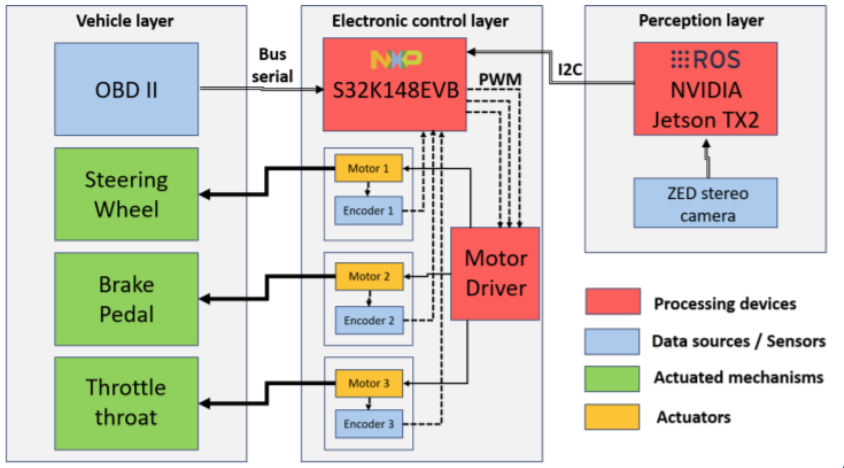
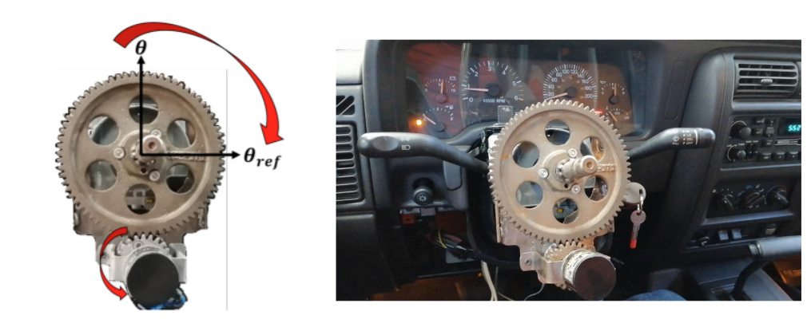
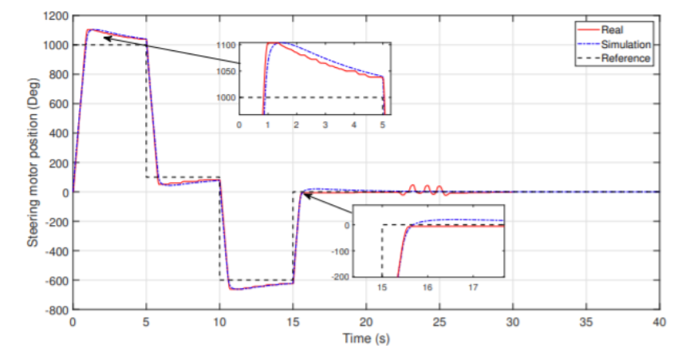

# iDrive - Autonomous SUV Platform

**ROS-based autonomous driving platform for an SUV, developed by students at Tecnologico de Monterrey, Guadalajara Campus.**

### Video Demo

[](https://drive.google.com/file/d/1HUaLQ2Hwt-5Ln_VqVuKjchc53ep7Aygt/view?usp=drive_link)

> [Watch the autonomous vehicle demo video](https://drive.google.com/file/d/1HUaLQ2Hwt-5Ln_VqVuKjchc53ep7Aygt/view?usp=drive_link)

### In the news

[Mechatronics students at Tec work to create autonomous mobility](https://conecta.tec.mx/es/noticias/guadalajara/investigacion/mecatronicos-del-tec-trabajan-para-crear-movilidad-autonoma) — Tec Review / Conecta Tec.

The project is developed by Mechatronics students at Tecnologico de Monterrey, Guadalajara Campus, within the **Center for the Car of the Future**, on a **2002 Jeep Grand Cherokee** (donated by NXP). The team built its own electronic steering system (gearbox), electronic throttle and brake control, and computer vision for lane following. All modifications are **minimally invasive**, which allows the vehicle to be returned to its original state. The goal is to build a smart-mobility lab that integrates mechanics, electronics, programming, and artificial intelligence.

---

## Overview

iDrive is a modular autonomous driving system that integrates multiple sensors (ZED stereo camera, LiDAR, NXP microcontroller) with perception, planning, and control algorithms. The vehicle is capable of:

- **Lane following** through computer-vision line detection
- **Real-time object detection** with GPU-accelerated YOLOv3
- **Distance measurement** with a LiDAR Lite v3 sensor
- **Autonomous control** of steering, throttle, and braking via the I2C interface

## System Architecture

```
ZED Stereo Camera
       |
       v
 [vga_zed_wrapper]
       |
   +---+---+
   |       |
   v       v
[YOLO]  [Lane Detector]
   |       |
   +---+---+
       |
       v
[Navigation Control]
       |
       v
[NXP Communication]
       |
       v
  Vehicle Actuators
```

### Hardware Architecture

System layout across three layers: perception (ROS + NVIDIA Jetson TX2 + ZED stereo camera), electronic control (NXP S32K148EVB microcontroller and motor driver), and vehicle (steering wheel, brake, and throttle actuated through OBD II).



## Technology Stack

| Component | Technology |
|-----------|------------|
| Middleware | ROS (Robot Operating System) |
| Build System | catkin |
| Perception | YOLOv3 (Darknet), OpenCV |
| GPU | CUDA + cuDNN |
| Camera | ZED SDK |
| Languages | C++ (core modules), Python (lane detection) |
| Hardware | NXP S32K148, LiDAR Lite v3 |

## Electronic Steering

Steering is actuated by a gearbox coupled to the steering wheel and driven by a motor with an encoder. The design is **minimally invasive**: it mounts on the original steering column without permanently modifying it.



### Steering motor control results

Position tracking of the steering motor against a step reference, comparing the **real** system to the **simulation**. The controller tracks the reference with low steady-state error across the full operating range.



## Project Structure

```
iDrive/
  jeep_master_node/     # Master node - launch configurations
  jeep_msgs/            # Custom ROS messages
  lane_detector/        # Lane detection subsystem (Python)
  ros_yolov3/           # YOLOv3 object detection (C++)
  navigation_control/   # Decision and control logic (C++)
  nxp_communication/    # Interface with the NXP microcontroller (C++)
  lidarlite_node/       # LiDAR Lite v3 sensor (C++)
  vga_zed_wrapper/      # ZED camera wrapper
  testing/              # Test scripts and utilities
  docs/                 # Detailed documentation
```

## Quick Start

### Prerequisites

- Ubuntu 16.04+ with ROS Kinetic (or newer)
- NVIDIA GPU with CUDA 9.1+ and cuDNN
- ZED SDK 2.x
- OpenCV 2.4.13 - 3.4.0

### Build

```bash
# Clone the repository into your catkin workspace
cd ~/catkin_ws/src
git clone <repository-url> iDrive

# Build
cd ~/catkin_ws
catkin_make

# Source the environment
source devel/setup.bash
```

### Run

```bash
# Full mode: lane detection + navigation + vehicle control
roslaunch jeep_master_node jeep_master_node_lane.launch

# YOLO mode: object detection + navigation + control
roslaunch jeep_master_node jeep_master_node_yolo.launch

# NXP mode: controller communication only
roslaunch jeep_master_node jeep_master_node_nxp.launch
```

## Documentation

| Document | Description |
|-----------|-------------|
| [Architecture](docs/ARCHITECTURE.md) | Data flow, diagrams, and inter-node communication |
| [Modules](docs/MODULES.md) | Detailed description of each ROS package |
| [Installation](docs/INSTALLATION.md) | Complete installation and dependency guide |
| [Hardware](docs/HARDWARE.md) | Sensor and I2C device configuration |
| [ROS Topics](docs/ROS_TOPICS.md) | Full reference of published and subscribed topics |

## Team

Developed by students at **Tecnologico de Monterrey, Guadalajara Campus**.

## License

Academic project - Tecnologico de Monterrey.
